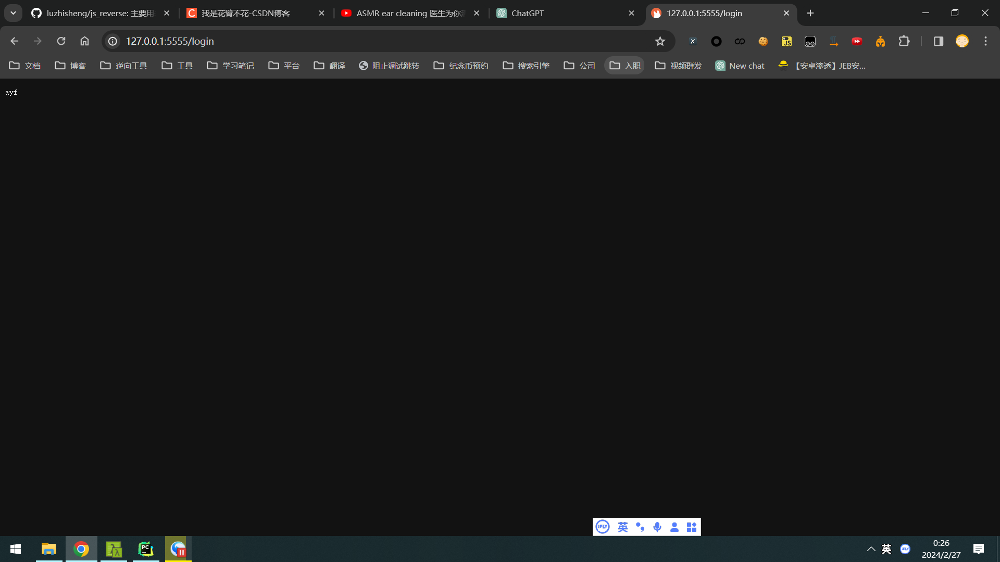

# 接口自动化测试

我感觉写过爬虫的再去写测试真的是降维打击！！！

## Mock 服务
Moco 服务器，Moco 是一个用于快速创建Mock服务器的库。通常，你需要提供更多的参数来指定 Moco 服务器的配置文件以及其他选项。 通常，你可以使用以下命令来启动 Moco 服务器：

```shell
java -jar moco-runner-<version>.standalone.jar start -p <port> -c <configuration_file.json>
```
```<version>``` 是 Moco 的版本号。

```<port>``` 是 Moco 服务器要监听的端口。

```<configuration_file.json>``` 是 Moco 服务器的配置文件，其中包含了你想要模拟的请求和对应的响应。

下载：https://github.com/dreamhead/moco/releases

命令启动
```shell
java -jar moco-runner-1.5.0-standalone.jar start -p 5555 -c 测试数据.json
```

配置文件内容
```json
[{
  "request": {
    "uri": "/login"
  },
  "response": {
    "text": "ay f"
  }
}]
```

访问接口地址：http://127.0.0.1:5555/login


