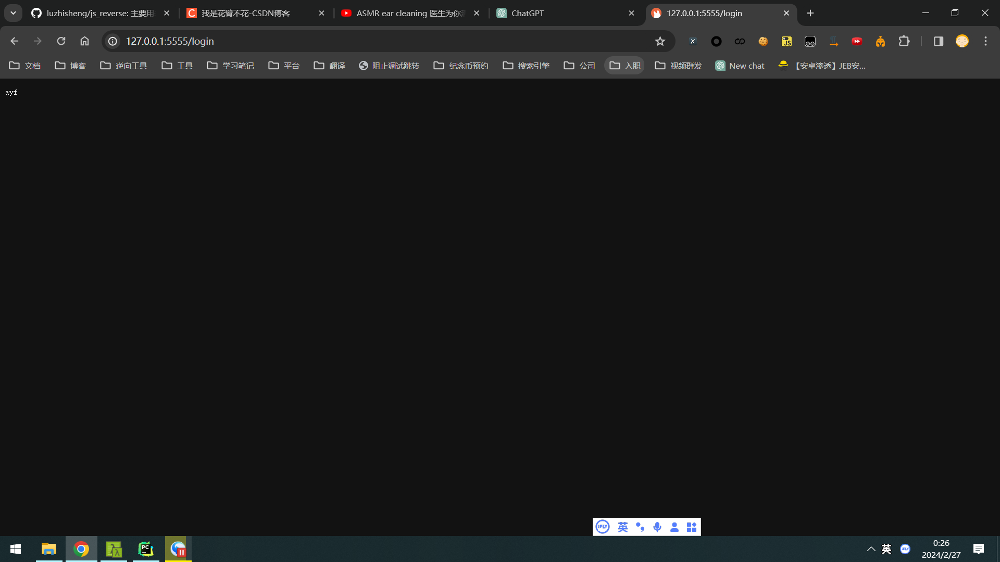
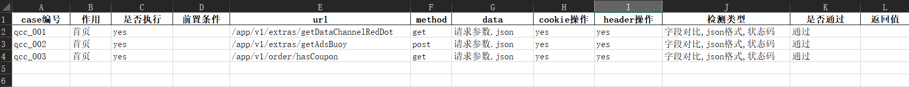
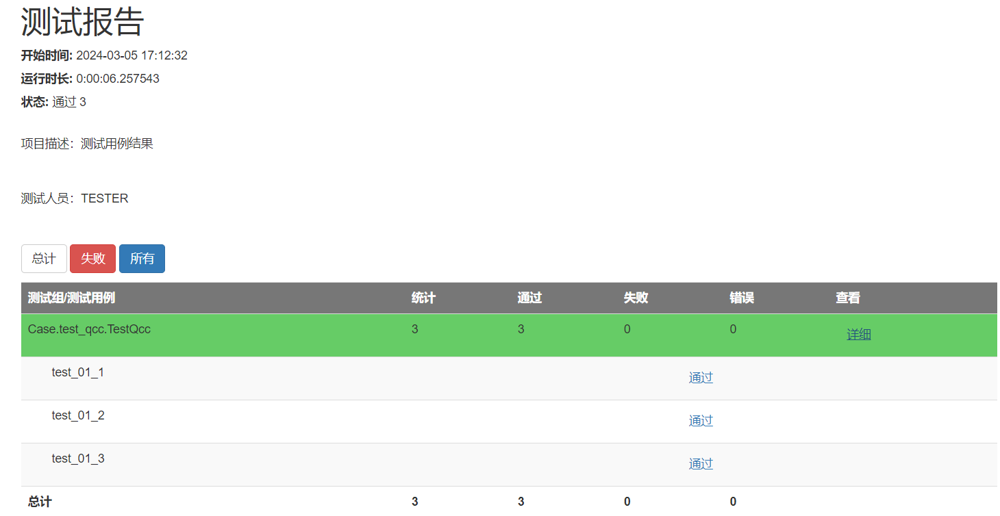

# 接口自动化测试

  * [一、前言](#----)
  * [二、Mock 服务](#--mock---)
  * [三、DDT数据驱动](#--ddt----)
  * [四、代码执行](#------)

## 一、前言

我感觉写过爬虫的再去写测试真的是降维打击！！！本项目用到mock作为测试服务器，pandas操作xlsx文件，通过ddt数据驱动完成对目标接口的测试。

## 二、Mock 服务
Moco 服务器，Moco 是一个用于快速创建Mock服务器的库。通常，你需要提供更多的参数来指定 Moco 服务器的配置文件以及其他选项。 通常，你可以使用以下命令来启动 Moco 服务器：

```shell
java -jar moco-runner-<version>.standalone.jar start -p <port> -c <configuration_file.json>
```
```<version>``` 是 Moco 的版本号。

```<port>``` 是 Moco 服务器要监听的端口。

```<configuration_file.json>``` 是 Moco 服务器的配置文件，其中包含了你想要模拟的请求和对应的响应。

下载：https://github.com/dreamhead/moco/releases

命令启动
```shell
java -jar moco-runner-1.5.0-standalone.jar start -p 5555 -c 测试数据.json
```

配置文件内容
```json
[{
  "request": {
    "uri": "/login"
  },
  "response": {
    "text": "ay f"
  }
}]
```

访问接口地址：http://127.0.0.1:5555/login



## 三、DDT数据驱动



简单用法：

```python
import unittest
from ddt import ddt, data

# 使用 @ddt 装饰器来标记测试类
@ddt
class TestDataDrivenWithDDT(unittest.TestCase):

    # 使用 @data 装饰器来指定测试数据
    @data((2, 3, 5), (5, 7, 12), (10, 0, 10), (-1, 1, 0))
    def test_addition(self, test_data):
        a, b, expected = test_data
        result = a + b
        self.assertEqual(result, expected)

if __name__ == '__main__':
    unittest.main()
```

所有case代码编写在Case目录下，可以编写多个case，通过`main.py`合并执行

代码目录：

    PyTestAutomation:.
        ├─Case   测试用例
        ├─Config mock服务配置文件/测试文件
        ├─File   数据驱动的数据
        ├─READMEIMG 文档图片
        ├─Report 报表导出
        ├─Util   工具类

## 四、代码执行

测试案例：`test_qcc.py`
```python
from Util.handle_excel import HandExcel
from Case.base import Base
from base_request import request
from Util.handle_json import read_json
from Util.handle_result import handle_result
import unittest
import ddt


@ddt.ddt
class TestQcc(unittest.TestCase, Base):
    hand_excel = HandExcel('qcc.xlsx')
    data = hand_excel.load_excel().values
    base_url = "http://127.0.0.1:5555"

    def setUp(self) -> None:
        self.log("case开始执行")

    def tearDown(self) -> None:
        self.log("case执行结束")

    @ddt.data(*data)
    def test_01(self, data_1):
        case, activity, is_run, term, url, method, param_data, cookie, header, my_variable, is_pass = data_1

        param_data = read_json(f'{case}|{url}', r"\Config\请求参数.json")
        res_data = read_json(f'{case}|{url}', r"\Config\预期结果.json")

        url = self.base_url + url

        if is_run == 'yes':
            flag, res = request.run_main(method=method, url=url, data=param_data)

            try:
                try:
                    if "json格式" in my_variable:
                        # 判断json格式是否正确
                        self.assertTrue(flag)
                        self.log("测试json格式通过")
                except Exception as e:
                    self.log("测试json格式失败")
                    raise e

                try:
                    if "状态码" in my_variable:
                        # 测试状态码是否正确
                        self.assertEqual(res['status'], 200)
                        self.assertEqual(res['message'], "成功")
                        self.log("测试状态码通过")
                except Exception as e:
                    self.log("测试状态码失败")
                    raise e

                try:
                    if "字段对比" in my_variable:
                        flag_field = handle_result(res, res_data)
                        self.assertTrue(flag_field)
                        self.log("测试字段对比通过")
                except Exception as e:
                    self.log("测试字段对比失败")
                    raise e

            except Exception as e:
                raise e
            else:
                self.hand_excel.write_excel(case, '是否通过', '通过')


if __name__ == '__main__':
    unittest.main()
```

执行代码`main.py`

```python
import unittest
from setting import current_directory
import HTMLTestRunner
from Case.test_qcc import TestQcc

suite = unittest.TestLoader().loadTestsFromTestCase(TestQcc)
file_path = current_directory + r"\Report\report.html"
with open(file_path, 'wb') as f:
    # 创建 HTMLTestRunner 实例
    runner = HTMLTestRunner.HTMLTestRunner(
        stream=f,
        title='测试报告',
        description='测试用例结果'
    )
    # 运行测试套件
    runner.run(suite)

```

效果图：

